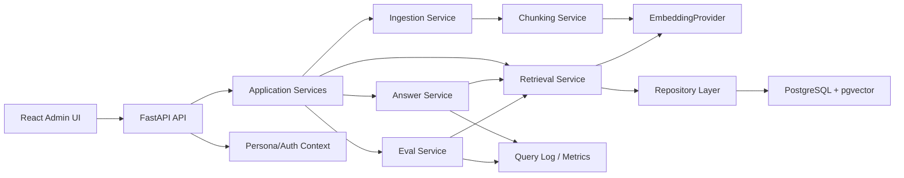

# Enterprise Policy RAG Product Architecture

작성일: 2026-05-20

## 1. 방향

`Enterprise Policy RAG`는 사내 정책, 업무 매뉴얼, 보안 지침 문서를 권한 기반으로 검색하고, 근거 있는 답변과 운영 지표를 제공하는 제품형 RAG 백엔드다.

기존 첫 구현은 retrieval core 중심이었다. 포트폴리오 관점에서는 화면이 없으면 사용 흐름과 운영 감각을 보여주기 어렵기 때문에, 앞으로는 백엔드와 함께 작은 관리자/운영 화면을 필수 범위로 둔다.

## 2. 참고 레퍼런스

레퍼런스는 구조와 UX 패턴만 참고하고, 화면을 그대로 복제하지 않는다.

| 레퍼런스 | 가져올 패턴 | 이 프로젝트에 반영할 방식 |
|---|---|---|
| Dify Knowledge | knowledge base, document/chunk 관리, retrieval test | `Knowledge Library`, `Retrieval Lab` 화면으로 축약 |
| Dify Retrieval Test / Citation | query simulation, retrieved chunk score, source 확인 | retrieval-only 단계부터 chunk score/source panel 표시 |
| Glean Search | unified search, permission-aware enterprise search | 최종 사용자 검색 화면에서 권한 배지와 근거 패널 표시 |
| Glean Admin Console | datasource, search management, access inspection | 문서별 visibility/department/owner 상태를 관리 화면에 표시 |
| Glean Insights | active usage, search count, department filter | `Operations` 화면에서 query, latency, cost, eval 지표 표시 |
| EnterpriseRAG-Bench | enterprise source mix, noisy internal knowledge, constrained retrieval | eval phase에서 질문 유형과 실패 케이스 설계 기준으로 사용 |

## 3. 제품 사용자

| 사용자 | 목적 | 핵심 화면 |
|---|---|---|
| Employee | 사내 정책 질문에 빠르게 답을 얻고 근거를 확인한다. | Search Console |
| Knowledge Admin | 문서를 등록하고 chunk/권한/검색 가능 상태를 관리한다. | Knowledge Library |
| AI/Platform Engineer | retrieval 품질, top-k, score threshold, provider 설정을 검증한다. | Retrieval Lab |
| Operations Owner | 사용량, latency, 비용 추정, eval 품질을 확인한다. | Operations |

초기 구현에서는 실제 로그인/조직도 연동 대신 `persona selector`로 user/department 권한을 시뮬레이션한다. 실제 인증과 SSO는 후속 phase로 둔다.

## 4. 필수 화면 구성

화면은 많게 만들지 않는다. 포트폴리오에서 제품의 핵심 가치가 보이는 4개 화면만 만든다.

### 4.1 Search Console

목적: 직원이 질문하고, 답변과 근거를 확인하는 대표 화면.

구성:

- 상단 persona selector: workspace, user, department
- 중앙 검색 입력
- 답변 영역: Phase 1에서는 retrieval-only 결과, Phase 2부터 generated answer
- 오른쪽 근거 패널: source document, chunk text, score, visibility badge
- 접근 제한 안내: 권한 때문에 제외된 결과 수는 노출하지 않고, “현재 권한에서 검색된 문서” 기준만 표시

포트폴리오 포인트:

- “권한 기반 RAG”가 한 화면에서 보인다.
- 같은 질문을 다른 persona로 바꾸면 결과가 달라지는 시나리오를 보여줄 수 있다.

### 4.2 Knowledge Library

목적: 문서 등록과 검색 가능 상태를 관리한다.

구성:

- 문서 리스트: title, source type, visibility, departments, owner, chunk count, indexed status
- 문서 등록 drawer/modal: title, content, content type, owner, departments, visibility
- 문서 상세 side panel: chunk list, chunk index, text preview, embedding status
- 필터: department, visibility, indexing status

포트폴리오 포인트:

- 단순 챗봇이 아니라 문서 운영 백엔드라는 점을 보여준다.
- document/chunk schema와 화면이 직접 연결된다.

### 4.3 Retrieval Lab

목적: 검색 품질과 권한 필터를 디버깅한다.

구성:

- query input
- persona selector
- retrieval settings: top-k, score threshold, strategy
- 결과 리스트: rank, score, document, chunk preview, visibility, access reason
- “왜 보였는가” 설명: public, owner, department match

Phase 1에서는 vector retrieval + fake embedding만 표시한다. Phase 2 이후 hybrid search/rerank 옵션을 추가할 수 있다.

포트폴리오 포인트:

- RAG 품질을 개발자가 어떻게 검증하는지 보여준다.
- permission filter가 ranking 전후 어디서 적용되는지 설명 가능하다.

### 4.4 Operations

목적: 운영 지표와 eval 결과를 보여준다.

구성:

- KPI cards: searches, p95 latency, answer refusal rate, estimated cost, retrieval hit rate
- query timeline chart
- top documents by citation/retrieval
- eval run table: dataset, pass rate, retrieval hit, citation coverage, created at
- query log table: query, persona, retrieved chunks, latency, provider

초기에는 seeded demo data로 화면을 구성하고, backend logging/eval 구현이 들어오면 실제 API와 연결한다.

포트폴리오 포인트:

- AI 기능을 “만들었다”가 아니라 운영 가능한 백엔드로 설계했다는 신호를 준다.

## 5. 화면 톤

화면은 SaaS 운영 도구처럼 차분하고 밀도 있게 만든다.

- 좌측 sidebar: Search, Knowledge, Retrieval Lab, Operations
- 상단 bar: workspace selector, environment badge, provider badge
- 색상: neutral base + restrained blue/green accents
- 카드 남발 금지: 반복 항목과 KPI에만 card 사용
- 텍스트: 한국어 중심, 기술 용어는 필요한 곳에만 영어 병기
- 첫 화면: marketing hero가 아니라 바로 Search Console

## 6. 시스템 아키텍처



## 7. Backend 경계

| 계층 | 책임 |
|---|---|
| API | request/response, validation, status code |
| Application Services | use case orchestration |
| Domain Services | chunking, permission decision, retrieval ranking, answer policy |
| Providers | external AI 호출 격리. `EmbeddingProvider`, `LLMProvider` |
| Repositories | PostgreSQL/pgvector persistence |
| Observability | query log, provider latency, estimated cost, eval result |

Provider 규칙:

- Phase 1은 `FakeEmbeddingProvider`만 사용한다.
- Phase 2에서 `FakeLLMProvider`를 먼저 만들고, 이후 OpenAI adapter를 추가한다.
- OpenAI adapter는 API key가 있을 때만 활성화된다.
- 테스트와 CI는 fake provider로 통과해야 한다.

## 8. Frontend 경계

권장 stack:

- React + TypeScript + Vite
- TanStack Query for API state
- Tailwind CSS 또는 CSS module 기반의 얇은 design token
- Chart는 lightweight library 1개만 사용

프론트엔드 구조:

```text
web/
  src/
    app/
    routes/
      search/
      knowledge/
      retrieval-lab/
      operations/
    components/
    api/
    fixtures/
    styles/
```

초기 UI는 인증 시스템 없이 `persona selector`로 권한 시나리오를 재현한다. 이는 포트폴리오 데모에 적합하고, 실제 SSO/OIDC는 후속 확장으로 분리할 수 있다.

## 9. 데이터 모델

Phase별로 확장하되, 최종 목표 모델은 먼저 고정한다.

| 모델 | 핵심 필드 | Phase |
|---|---|---|
| workspace | id, name | 1 |
| user_profile | id, workspace_id, display_name, department_ids, role | UI demo/후속 auth |
| document | id, workspace_id, title, source_uri, content_type, owner_user_id, department_ids, visibility, status | 1 |
| document_chunk | id, document_id, workspace_id, chunk_index, text, embedding | 1 |
| retrieval_query | id, workspace_id, user_id, query, top_k, latency_ms, provider | 3 |
| retrieval_result | query_id, chunk_id, rank, score, access_reason | 3 |
| answer | query_id, text, refusal_reason, provider, token_count, estimated_cost | 2/3 |
| citation | answer_id, chunk_id, quote_text, score | 2 |
| eval_dataset | id, name, description | 3 |
| eval_case | dataset_id, question, expected_document_ids, required_citation | 3 |
| eval_run | dataset_id, provider, retrieval_hit_rate, citation_coverage, created_at | 3 |

## 10. API Surface

초기 API는 화면 요구에서 역산한다.

| API | 화면 | Phase |
|---|---|---|
| `GET /health` | system smoke | 1 |
| `GET /workspaces/current` | layout/header | UI foundation |
| `GET /personas` | persona selector | UI foundation |
| `POST /documents` | Knowledge Library | 1 |
| `GET /documents` | Knowledge Library | UI foundation |
| `GET /documents/{id}` | document detail | UI foundation |
| `POST /retrieve` | Search Console, Retrieval Lab | 1 |
| `POST /answer` | Search Console | 2 |
| `GET /queries` | Operations | 3 |
| `GET /metrics/summary` | Operations | 3 |
| `POST /eval-runs` | Operations | 3 |
| `GET /eval-runs` | Operations | 3 |

## 11. Phase Plan

### Phase 0.5: Architecture Reset

완료 기준:

- 이 문서가 존재한다.
- TODO/project tracking이 화면 포함 방향으로 갱신된다.
- 기존 retrieval core 구현은 “prototype slice”로 유지하되, 다음 구현은 UI/API/data plan에 맞춘다.

### Phase 1: Retrieval Core + Search UI

완료 기준:

- FastAPI retrieval core가 PostgreSQL/pgvector repository를 사용한다.
- Search Console이 `POST /retrieve`와 연결된다.
- Knowledge Library에서 문서를 등록하고 목록/상세를 볼 수 있다.
- persona selector로 권한별 결과 차이를 시연할 수 있다.
- API key 없이 demo/test가 가능하다.

### Phase 2: Answer + Citation

완료 기준:

- `LLMProvider`와 `FakeLLMProvider`가 구현된다.
- `POST /answer`가 답변과 citation을 반환한다.
- 근거 부족 시 refusal response를 반환한다.
- Search Console에 answer panel과 citation panel이 연결된다.

### Phase 3: Retrieval Lab + Operations

완료 기준:

- Retrieval Lab에서 top-k, threshold, persona를 조정하며 결과를 비교한다.
- query log, latency, provider, retrieved chunks가 기록된다.
- Operations 화면이 usage, latency, cost estimate, retrieval hit/eval 결과를 표시한다.

### Phase 4: Portfolio Package

완료 기준:

- README에 demo flow, architecture, screenshots가 정리된다.
- 화면 캡처와 runbook이 재현 가능하게 남는다.
- 포트폴리오 one-pager에 문제, 구조, 검증, trade-off가 정리된다.

## 12. 데모 시나리오

1. Knowledge Admin이 `Remote Access Policy`, `Security Incident Manual`, `Finance Reimbursement Policy`를 등록한다.
2. Employee persona를 `security`로 선택하고 VPN 질문을 검색한다.
3. Search Console은 접근 가능한 chunk와 근거를 보여준다.
4. 같은 질문을 `finance` persona로 바꾸면 보이는 결과가 달라진다.
5. Retrieval Lab에서 top-k와 score threshold를 바꾸며 결과를 비교한다.
6. Operations에서 query count, latency, top retrieved documents, eval run 결과를 확인한다.

## 13. 구현 원칙

- 화면은 작게 시작하지만 반드시 포함한다.
- 첫 화면은 Search Console이다.
- 백엔드 기능은 화면에서 보여줄 수 있는 단위로 자른다.
- fake provider와 seeded demo data를 우선해서 API key 없는 데모를 보장한다.
- OpenAI adapter는 provider 경계 안정화 이후 추가한다.
- 온프레미스 배포는 계속 1차 범위에서 제외한다.
- 레퍼런스는 패턴만 가져오고, UI/문구/레이아웃은 새로 만든다.
