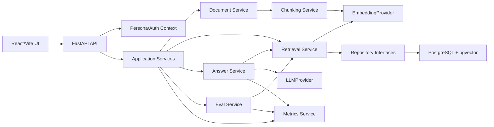

# Enterprise Policy RAG Master Implementation Plan

작성일: 2026-05-20

## 1. 목표

`Enterprise Policy RAG`는 기업 내부 정책, 업무 매뉴얼, 보안 지침 문서를 권한 기반으로 검색하고, 근거 있는 답변과 운영 지표를 제공하는 포트폴리오용 제품형 RAG 시스템이다.

이 문서는 전체 구현 순서를 고정한다. 앞으로의 작업은 단순 backend 기능 목록이 아니라 화면에서 시연 가능한 vertical slice 단위로 진행한다.

## 2. 제품 범위

### 포함

- 사내 문서 등록과 chunk 관리
- workspace, user, department, visibility 기반 권한 필터
- PostgreSQL + pgvector 기반 retrieval
- fake embedding/LLM provider를 통한 API key 없는 개발과 CI
- OpenAI adapter는 후순위 선택 기능
- 답변 생성과 citation
- retrieval 품질 확인 화면
- 운영 지표와 eval 결과 화면
- 포트폴리오용 runbook, screenshot, architecture artifact

### 제외

- 1차 범위의 온프레미스 배포
- Kubernetes 운영 자동화
- 대규모 문서 파서 제품화
- 실제 조직 SSO/OIDC 연동
- 결제/과금 시스템
- 복잡한 multi-agent workflow

## 3. 필수 화면

| 화면 | 우선순위 | 사용자 | 핵심 가치 |
|---|---:|---|---|
| Search Console | 1 | Employee | 권한 내 문서를 검색하고 근거를 확인한다 |
| Knowledge Library | 2 | Knowledge Admin | 문서와 chunk, visibility, department 상태를 관리한다 |
| Retrieval Lab | 3 | AI/Platform Engineer | 검색 품질과 권한 필터를 디버깅한다 |
| Operations | 4 | Operations Owner | 사용량, latency, 비용 추정, eval 품질을 확인한다 |

첫 화면은 Search Console이다. 별도 landing page는 만들지 않는다.

## 4. 최종 시스템 구조



## 5. Repository Layout 목표

```text
enterprise-policy-rag/
  app/
    api/
    core/
    domain/
    providers/
    repositories/
    services/
  web/
    src/
      app/
      api/
      components/
      routes/
      fixtures/
      styles/
  infra/
    postgres/
    demo/
  docs/
    internal/
      design/
      plans/
    runbooks/
    assets/
      screenshots/
  tests/
    api/
    domain/
    integration/
  .ai-runs/
```

현재 prototype은 `app/*.py` 단일 계층에 가깝다. PostgreSQL persistence와 frontend가 들어가는 시점에 위 구조로 정리한다.

## 6. Backend Module 계획

| Module | 책임 | 주요 파일 |
|---|---|---|
| `app/api` | FastAPI router, request/response schema 연결 | `documents.py`, `retrieval.py`, `answers.py`, `metrics.py`, `evals.py` |
| `app/domain` | 순수 도메인 모델과 권한 판단 | `models.py`, `permissions.py`, `chunking.py` |
| `app/providers` | 외부 AI 호출 격리 | `embedding.py`, `llm.py`, `fake.py`, `openai.py` |
| `app/repositories` | PostgreSQL/pgvector 저장소 | `documents.py`, `queries.py`, `evals.py` |
| `app/services` | use case orchestration | `document_service.py`, `retrieval_service.py`, `answer_service.py`, `metrics_service.py` |
| `app/core` | config, DB session, app factory | `config.py`, `database.py`, `dependencies.py` |

Provider 원칙:

- 모든 AI 호출은 `EmbeddingProvider`, `LLMProvider` 뒤에 둔다.
- fake provider는 기본값이다.
- OpenAI provider는 API key가 있을 때만 활성화된다.
- 테스트와 CI는 외부 AI 호출 없이 통과해야 한다.

## 7. Frontend Module 계획

| Module | 책임 | 주요 파일 |
|---|---|---|
| `web/src/app` | app shell, router, global state | `App.tsx`, `routes.tsx`, `queryClient.ts` |
| `web/src/api` | typed API client | `client.ts`, `documents.ts`, `retrieval.ts`, `metrics.ts` |
| `web/src/components/layout` | sidebar, top bar, page shell | `AppShell.tsx`, `Sidebar.tsx`, `TopBar.tsx` |
| `web/src/components/persona` | workspace/user/department selector | `PersonaSelector.tsx` |
| `web/src/routes/search` | Search Console | `SearchPage.tsx`, `ResultList.tsx`, `EvidencePanel.tsx` |
| `web/src/routes/knowledge` | Knowledge Library | `KnowledgePage.tsx`, `DocumentDrawer.tsx`, `ChunkPanel.tsx` |
| `web/src/routes/retrieval-lab` | Retrieval Lab | `RetrievalLabPage.tsx`, `RetrievalSettings.tsx` |
| `web/src/routes/operations` | Operations | `OperationsPage.tsx`, `MetricCards.tsx`, `EvalTable.tsx` |
| `web/src/fixtures` | no-key demo fixtures | `personas.ts`, `demoDocuments.ts`, `demoMetrics.ts` |

UI 원칙:

- 운영 SaaS 도구처럼 조용하고 밀도 있게 만든다.
- 큰 hero나 마케팅 섹션을 만들지 않는다.
- sidebar와 top bar는 항상 유지한다.
- 카드 중첩을 피한다.
- 화면 텍스트는 한국어 중심으로 작성한다.
- 아이콘은 가능하면 lucide-react를 사용한다.
- 데모 데이터는 실제 사내 정책처럼 보이되 민감정보는 포함하지 않는다.

## 8. 데이터 모델 계획

### Phase 1A 필수 모델

| Table | 주요 필드 | 목적 |
|---|---|---|
| `workspaces` | `id`, `name`, `created_at` | workspace 경계 |
| `user_profiles` | `id`, `workspace_id`, `display_name`, `department_ids`, `role` | persona selector와 권한 시나리오 |
| `documents` | `id`, `workspace_id`, `title`, `source_uri`, `content_type`, `owner_user_id`, `department_ids`, `visibility`, `status`, `created_at` | 문서 metadata |
| `document_chunks` | `id`, `document_id`, `workspace_id`, `chunk_index`, `text`, `embedding`, `created_at` | 검색 단위 |

### Phase 2 이후 모델

| Table | 주요 필드 | 목적 |
|---|---|---|
| `query_logs` | `id`, `workspace_id`, `user_id`, `query`, `mode`, `latency_ms`, `provider`, `created_at` | 검색/답변 호출 기록 |
| `retrieval_results` | `query_log_id`, `chunk_id`, `rank`, `score`, `access_reason` | 검색 결과 분석 |
| `answers` | `query_log_id`, `answer_text`, `refusal_reason`, `provider`, `token_count`, `estimated_cost` | 답변과 비용 추정 |
| `citations` | `answer_id`, `chunk_id`, `quote_text`, `score` | 답변 근거 |
| `eval_datasets` | `id`, `name`, `description` | eval set |
| `eval_cases` | `dataset_id`, `question`, `expected_document_ids`, `required_terms` | eval question |
| `eval_runs` | `dataset_id`, `provider`, `retrieval_hit_rate`, `citation_coverage`, `created_at` | eval 결과 |

권한 규칙:

- query workspace와 document workspace가 같아야 한다.
- `public` 문서는 같은 workspace 사용자에게 보인다.
- `department` 문서는 사용자 department와 document department가 하나 이상 겹칠 때 보인다.
- `private` 문서는 owner user에게만 보인다.
- UI와 API는 권한 때문에 제외된 문서 수를 직접 노출하지 않는다.

## 9. API 계획

### Foundation API

| Method | Path | 화면 | 설명 |
|---|---|---|---|
| GET | `/health` | smoke | backend 상태 |
| GET | `/workspaces/current` | layout | 현재 workspace 정보 |
| GET | `/personas` | all | demo persona 목록 |

### Document API

| Method | Path | 화면 | 설명 |
|---|---|---|---|
| POST | `/documents` | Knowledge Library | Markdown/TXT 문서 등록 |
| GET | `/documents` | Knowledge Library | 문서 목록 |
| GET | `/documents/{document_id}` | Knowledge Library | 문서 상세와 chunk 목록 |
| DELETE | `/documents/{document_id}` | 후순위 | 문서 삭제 |

### Retrieval API

| Method | Path | 화면 | 설명 |
|---|---|---|---|
| POST | `/retrieve` | Search Console | 권한 필터가 적용된 retrieval |
| POST | `/retrieve/debug` | Retrieval Lab | access reason, threshold, ranking detail 포함 |

### Answer API

| Method | Path | 화면 | 설명 |
|---|---|---|---|
| POST | `/answer` | Search Console | fake LLM 기반 답변과 citation |

### Operations API

| Method | Path | 화면 | 설명 |
|---|---|---|---|
| GET | `/queries` | Operations | query log |
| GET | `/metrics/summary` | Operations | KPI summary |
| POST | `/eval-runs` | Operations | eval 실행 |
| GET | `/eval-runs` | Operations | eval 결과 목록 |

## 10. Phase Roadmap

### Phase 0.5: Architecture Baseline

목적:

- 전체 제품 그림과 구현 순서를 고정한다.

작업:

- [x] 제품 아키텍처 문서 작성
- [x] 화면 포함 구현 계획 작성
- [x] master plan 작성
- [x] README/TODO/project-tracking/bootstrap 링크 정리

완료 기준:

- 다음 구현자가 화면 포함 방향을 혼동하지 않는다.
- 첫 구현 목표가 `Frontend Shell + Demo Personas`로 명확하다.

검증:

- 문서 placeholder 검색
- 금지 용어 검색
- git status로 변경 범위 확인

### Phase 1A: Frontend Shell + Demo Personas

목적:

- 포트폴리오 첫인상이 되는 앱 shell을 만든다.

Backend 작업:

- `GET /workspaces/current` 추가
- `GET /personas` 추가
- 기존 `create_app()` 구조를 router 기반으로 이동할 준비

Frontend 작업:

- Vite + React + TypeScript skeleton
- sidebar route: Search, Knowledge, Retrieval Lab, Operations
- top bar: workspace, persona selector, provider badge
- shared design tokens
- no-key demo fixtures

예상 파일:

- `web/package.json`
- `web/vite.config.ts`
- `web/src/app/App.tsx`
- `web/src/app/routes.tsx`
- `web/src/components/layout/AppShell.tsx`
- `web/src/components/persona/PersonaSelector.tsx`
- `web/src/styles/tokens.css`
- `app/api/system.py`
- `app/api/personas.py`

완료 기준:

- `web` 앱이 local dev server에서 열린다.
- sidebar와 top bar가 desktop/mobile에서 깨지지 않는다.
- persona 변경 상태가 Search/Knowledge/Retrieval Lab에서 공유된다.
- API key가 없어도 UI가 열린다.

검증:

- frontend typecheck
- frontend unit/smoke test
- backend pytest
- browser screenshot smoke

### Phase 1B: Search Console Vertical Slice

목적:

- 권한 기반 retrieval이 실제 화면에서 보이게 한다.

Backend 작업:

- `POST /retrieve` response에 다음 필드를 포함한다.
  - `rank`
  - `score`
  - `document_id`
  - `title`
  - `source_uri`
  - `chunk_index`
  - `text`
  - `visibility`
  - `department_ids`
  - `access_reason`
- `score_threshold` request option 추가
- permission decision을 별도 함수로 분리

Frontend 작업:

- Search Console query form
- result list
- evidence side panel
- score/visibility/access reason badge
- empty state
- retrieval-only 안내 문구

완료 기준:

- `security` persona와 `finance` persona에서 같은 query 결과가 다르게 나온다.
- private 문서는 owner 외 사용자에게 보이지 않는다.
- 화면에 답변 생성이 아직 후순위임이 자연스럽게 드러난다.

검증:

- permission filter unit test
- retrieval API test
- Search Console UI smoke test
- persona 변경 screenshot 비교

### Phase 1C: Knowledge Library + PostgreSQL Persistence

목적:

- 문서 등록과 검색을 실제 DB path로 연결한다.

Backend 작업:

- PostgreSQL connection 설정
- repository interface 정리
- `PostgresPolicyRepository` 구현
- migration/init SQL 정리
- `GET /documents`
- `GET /documents/{id}`
- seed script 작성

Frontend 작업:

- Knowledge Library table
- create document drawer
- document detail panel
- chunk preview panel
- visibility/department filters
- indexing status 표시

완료 기준:

- Docker Compose DB에 문서를 저장한다.
- 등록한 문서가 reload 후에도 유지된다.
- 문서 detail에서 chunk를 확인할 수 있다.
- Search Console이 DB에 저장된 chunk를 검색한다.

검증:

- repository integration test
- document API test
- compose smoke
- UI smoke: 문서 등록 후 검색

### Phase 2A: Fake Answer + Citation

목적:

- API key 없이 답변 생성과 근거 UX를 완성한다.

Backend 작업:

- `LLMProvider` interface 정리
- `FakeLLMProvider` 구현
- `AnswerService` 구현
- `POST /answer`
- refusal policy 구현
- citation model 구현

Frontend 작업:

- Search Console answer panel
- citation cards
- unsupported answer state
- answer/retrieval mode toggle

완료 기준:

- retrieved chunk가 있을 때 fake answer와 citation이 나온다.
- 근거가 부족하면 답변을 거부한다.
- citation click 시 evidence panel이 해당 chunk로 이동한다.

검증:

- answer generation API test
- refusal policy test
- citation mapping test
- UI smoke: answer + citation flow

### Phase 2B: Optional OpenAI Adapter

목적:

- 실제 OpenAI API 연결은 provider 선택 기능으로 추가한다.

Backend 작업:

- OpenAI embedding adapter
- OpenAI LLM adapter
- config/env validation
- provider selection
- API key 미설정 시 fake provider fallback

Frontend 작업:

- provider badge
- provider selection 상태 표시
- OpenAI disabled state

완료 기준:

- API key 없이 fake provider test가 계속 통과한다.
- API key가 있을 때만 OpenAI provider smoke가 가능하다.
- CI는 OpenAI key를 요구하지 않는다.

검증:

- fake provider regression test
- config test
- optional OpenAI smoke script

### Phase 3A: Retrieval Lab

목적:

- retrieval 품질과 권한 필터를 운영자가 디버깅할 수 있게 한다.

Backend 작업:

- `POST /retrieve/debug`
- top-k, score threshold, strategy parameter
- access reason detail
- query timing measurement

Frontend 작업:

- Retrieval Lab query input
- top-k control
- score threshold slider/input
- ranked result table
- access reason column
- result detail panel

완료 기준:

- top-k 변경이 결과 수에 반영된다.
- threshold 변경이 낮은 score 결과를 제거한다.
- 각 result의 access reason이 보인다.

검증:

- threshold API test
- debug retrieval API test
- UI smoke: top-k/threshold 변경

### Phase 3B: Operations + Query Log

목적:

- 운영 지표 화면을 실제 query log와 연결한다.

Backend 작업:

- query log 저장
- retrieval result log 저장
- latency 측정
- estimated cost 계산
- `GET /queries`
- `GET /metrics/summary`

Frontend 작업:

- Operations KPI cards
- query trend chart
- query log table
- top retrieved documents table
- provider/latency/cost filters

완료 기준:

- Search Console과 Retrieval Lab 호출이 query log에 남는다.
- Operations 화면에서 query count, p95 latency, provider, cost estimate가 보인다.
- seeded demo data 없이도 실제 호출 기반 지표가 표시된다.

검증:

- query log repository test
- metrics API test
- UI smoke: 검색 후 Operations 반영

### Phase 3C: Eval Runner

목적:

- retrieval 품질을 반복 측정한다.

Backend 작업:

- eval dataset fixture
- eval case loader
- retrieval hit calculation
- citation coverage calculation
- `POST /eval-runs`
- `GET /eval-runs`

Frontend 작업:

- eval run table
- eval detail panel
- failed cases list
- dataset selector

완료 기준:

- golden question set으로 retrieval hit를 계산한다.
- fake answer citation coverage를 계산한다.
- Operations 화면에서 eval run 결과를 볼 수 있다.

검증:

- eval runner unit test
- eval API test
- UI smoke: eval run 표시

### Phase 4: Portfolio Package

목적:

- 결과물을 평가자에게 보여줄 수 있는 형태로 정리한다.

작업:

- README를 공개용으로 재정리
- architecture SVG 작성
- demo runbook 작성
- screenshot 자동 캡처
- portfolio one-pager 작성
- implementation decisions 정리

산출물:

- `docs/runbooks/demo.md`
- `docs/assets/architecture/enterprise-policy-rag.svg`
- `docs/assets/screenshots/*.png`
- `docs/portfolio/one-pager.md`
- `docs/portfolio/interview-guide.md`

완료 기준:

- 새 환경에서 demo를 재현할 수 있다.
- README만 봐도 문제, 구조, 실행, 검증 결과가 보인다.
- 화면 캡처가 최신 UI와 일치한다.

검증:

- full demo smoke
- screenshot smoke
- README command check

## 11. 공통 검증 기준

모든 구현 run은 다음 파일을 남긴다.

```text
.ai-runs/<run-id>/goal.md
.ai-runs/<run-id>/agent-plan.md
.ai-runs/<run-id>/changed-files.md
.ai-runs/<run-id>/decisions.md
.ai-runs/<run-id>/verification.md
```

Backend 검증:

- `pytest -q`
- `python3 -m compileall -q app`
- `docker compose config -q`
- DB integration slice에서는 compose DB smoke

Frontend 검증:

- package manager install state 확인
- typecheck
- unit/smoke test
- Playwright 또는 browser screenshot smoke
- desktop/mobile viewport 확인

문서 검증:

- placeholder 검색
- 금지 용어 검색
- README command 최신성 확인

## 12. Demo Data 계획

Persona:

| user | department | role |
|---|---|---|
| Mina Kim | Security | employee |
| Joon Park | Finance | employee |
| Hana Lee | People | employee |
| Admin Choi | Platform | admin |

Documents:

| title | visibility | departments | demo purpose |
|---|---|---|---|
| Remote Access Policy | public | Security, Platform | 모든 persona가 검색 가능 |
| Security Incident Manual | department | Security | security persona만 검색 가능 |
| Finance Reimbursement Policy | department | Finance | finance persona만 검색 가능 |
| Executive Access Exception | private | Platform | owner만 검색 가능 |

Questions:

| question | expected behavior |
|---|---|
| VPN 등록 절차는 어떻게 돼? | public remote access 문서 반환 |
| 보안 사고 발생 시 누구에게 알려야 해? | security persona만 security manual 반환 |
| 식대 정산 기준 알려줘 | finance persona만 reimbursement policy 반환 |
| 임원 접근 예외 절차 알려줘 | owner 외 persona는 결과 없음 |

## 13. 다음 작업 지시

다음 구현 run은 `Phase 1A: Frontend Shell + Demo Personas`만 수행한다.

작업 순서:

1. `.ai-runs/<run-id>/` 기록 파일을 먼저 만든다.
2. frontend package manager와 기존 lockfile 상태를 확인한다.
3. React/Vite skeleton을 만든다.
4. sidebar/top bar/persona selector/route shell을 만든다.
5. Search, Knowledge, Retrieval Lab, Operations placeholder route를 만든다.
6. 화면 smoke test와 screenshot 검증을 수행한다.
7. README/TODO/project-tracking을 갱신한다.

이 단계에서는 PostgreSQL repository, answer generation, eval, OpenAI adapter를 구현하지 않는다.
