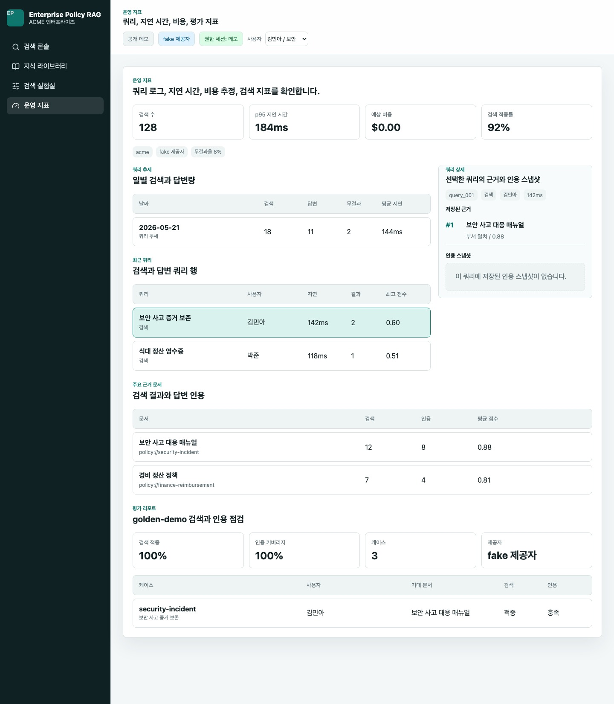
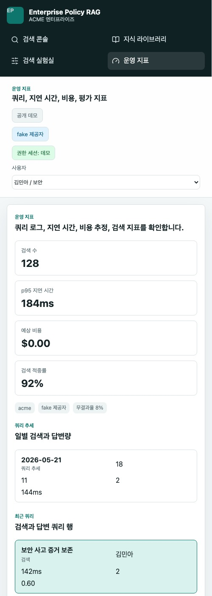
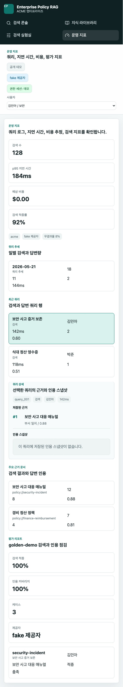
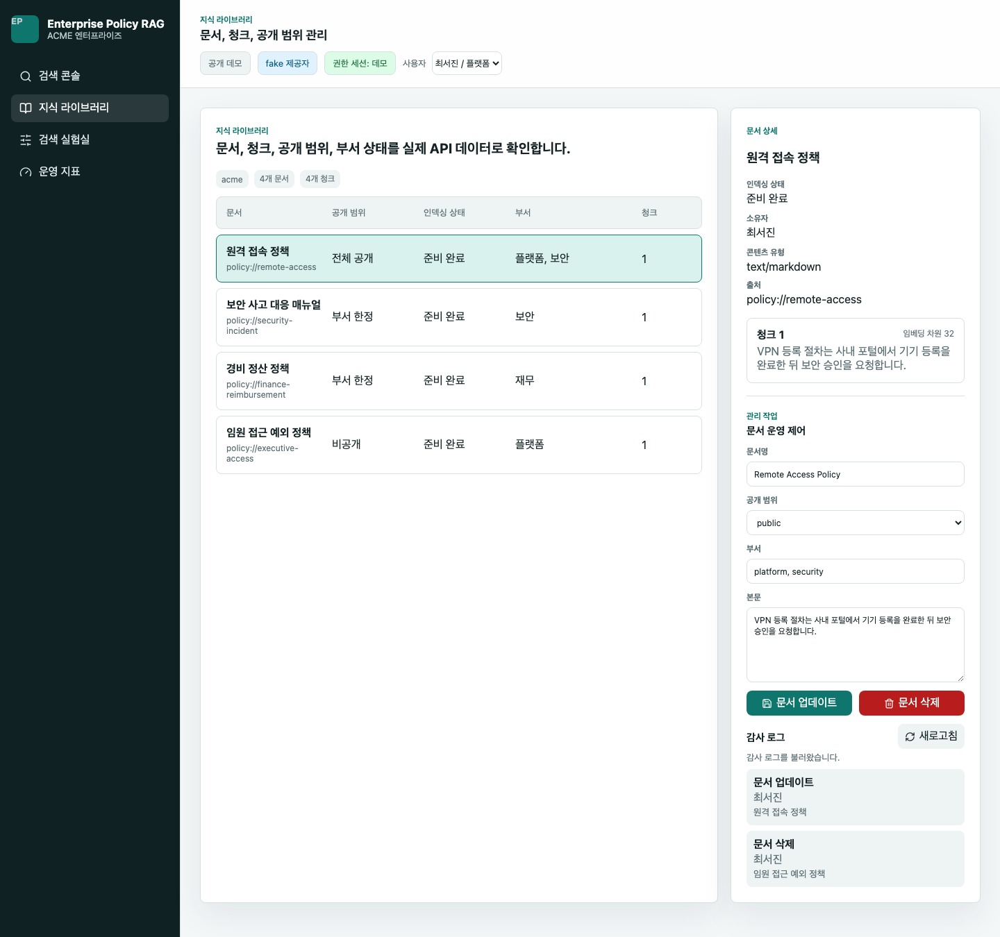

# Enterprise Policy RAG One-Pager

## Summary

Enterprise Policy RAG는 기업 내부 정책, 업무 매뉴얼, 보안 지침을 권한 기반으로 검색하고 근거 있는 답변과 운영 지표를 제공하는 RAG 백엔드와 데모 콘솔입니다. 포트폴리오 화면은 한국어 인터페이스로 구성했고, 엔터프라이즈 AI 시스템에서 중요한 권한, 근거, provider 분리, 평가, 지연 시간/비용 가시성, 재현 가능한 로컬 검증을 보여줍니다.

## What It Shows

- Policy document ingestion with deterministic chunking
- Permission-aware retrieval by workspace, owner, department, and visibility
- Fake embedding and fake LLM providers for API key-free development
- Opt-in OpenAI Responses API transport behind the LLM provider interface
- Opt-in OIDC JWT auth provider behind the auth context interface
- Cited answer API with explicit refusal when evidence is missing
- 검색 콘솔: 사용자 질문, 근거 기반 답변, 인용 확인
- 지식 라이브러리: 문서, 청크, 공개 범위 점검
- 검색 실험실: top-k와 점수 기준 디버깅
- 운영 지표: 쿼리 로그 지표, 쿼리 추세, 최근 쿼리 drilldown, 주요 근거 문서, 평가 리포트
- Persisted eval history for retrieval hit and citation coverage checks
- PostgreSQL + pgvector schema and optional repository implementation

## Technical Shape

| Area | Implementation |
|---|---|
| API | Python, FastAPI-compatible app factory |
| UI | React, TypeScript, Vite |
| Provider boundary | `EmbeddingProvider`, `LLMProvider` |
| Default local path | in-memory repository + fake providers |
| DB-ready path | PostgreSQL + pgvector compose/schema/repository |
| Public demo path | static read-only build with `VITE_DEMO_MODE=static` |
| Verification | pytest, frontend smoke, build, browser smoke |

## Demo Flow

Public demo:

```text
https://enterprise-policy-rag.vercel.app
```

Repository:

```text
https://github.com/cyson21/enterprise-policy-rag
```

1. `김민아 / 보안` 사용자로 검색 콘솔에서 보안 사고 질문을 실행합니다.
2. `보안 사고 대응 매뉴얼`의 인용 답변과 근거 청크를 확인합니다.
3. `박준 / 재무` 사용자로 전환해 제한된 보안 문서가 제외되는지 확인합니다.
4. 지식 라이브러리에서 공개 범위, 부서, 소유자, 청크 preview를 확인합니다.
5. 검색 실험실에서 top-k와 점수 기준을 조정합니다.
6. 운영 지표에서 metric, 쿼리 추세, 선택 쿼리 상세, 주요 근거 문서, 검색 적중률, 인용 커버리지를 확인합니다.

## Demo Screenshots









## Current Boundaries

- No OpenAI API call is required.
- The OpenAI live transport and live smoke are opt-in and not part of default local verification.
- The static public demo mode does not call `/api`; it uses read-only fake-provider fixtures.
- On-premises deployment is outside the first scope.
- PostgreSQL document and query log repositories are verified with low-resource Colima; the default app path remains in-memory unless `DATABASE_URL` is set.
- `DATABASE_URL` switches the runtime to PostgreSQL-backed document, query log, and eval repositories.
- OAuth redirect/session-cookie flow is not included. The auth/SSO boundary, OIDC JWT adapter, admin document workflow API, and Knowledge Library admin controls are implemented.

## Closeout

Project 02 portfolio scope is complete. A real production SaaS rollout would start from `docs/runbooks/production-hardening-checklist.md`.
